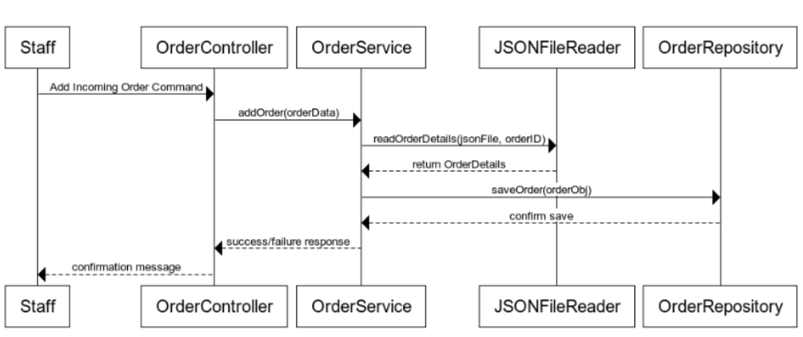

# Group Notes Doc: 
****
### Tasks:
1. Class diagram
2. sequence diagram of the add incoming order operation
   
   
    -    Link to UML diagrams :
divide up the classes into personal contributions.

